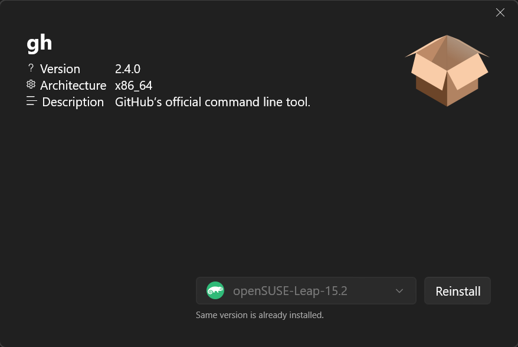

  

<h3 align="center">Winstrumenta A collection of tools for WSL & WSA 🥳</h3>

    The `Winstrumenta` toolset focuses on Windows Subsystem for Linux (WSL) and Android (WSA). 
     
    <a href="https://github.com/Gitii/Winstrumenta"><strong>Explore the docs »</strong></a>
     
     
    <a href="https://github.com/Gitii/Winstrumenta/issues">Report Bug</a> ·
    <a href="https://github.com/Gitii/Winstrumenta/issues">Request Feature</a>
  

---

### Winstrumenta - A collection of tools for WSL & WSA

The `Winstrumenta` toolset focuses on Windows Subsystem for Linux (WSL) and Android (WSA). The goal is to make the life of developers and users easier by providing quality of life tools for every day use cases.

The main tool right now is `Package Manager`. 

# Package Manager

  

`Package Manager` is graphical use interface for managing `deb` and `rpm` packages. It integrates into seamlessy in the windows explorer.

- Both `deb` and `rpm` packages are supported

- Easy selection of target distribution (if there are multiple)

- Uses native package managers of the selected distribution for compability

- Easy up- or downgrade of packages

## Getting started with `Package Manager`

Package Manager is distributed through the `Microsoft Store`:  

Please note that `WSL 2` needs to be activated and running. WSL 1 should be working but hasn't been tested.

---

## Roadmap

* Support dependencies: Currently `dpkg` and `rpm` are used to install packages. Both doesn't support dependency resolution.

* Support more package formats:
  
  * Alpine packages (`apk`)
  
  * Android packages (`apk`) for physical devices and emulators (including WSA)
  
  * Arch packages (`ar`)

* Advanced package management:
  
  * Easy uninstallation
  
  * Extract/View instead of install or uninstall 

---

# ⚠️ License

Winstrumenta is free and open-source software licensed under MIT.  

# 🔒 Data Privacy

## Information collected

All apps in the by Winstrumenta toolset do not collect any personal identiying information. 

## Use of information

No information is collected or shared over the wire. We reserve the right to 
make changes to this policy. Any changes to this policy will be updated. 

 
