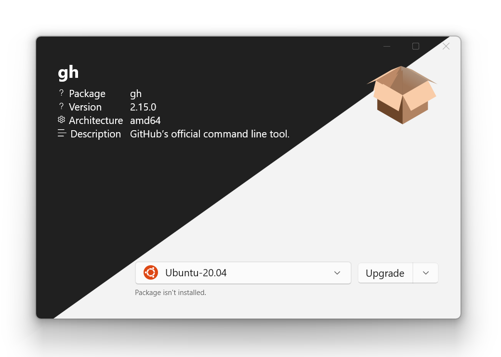

  

<h3 align="center">Winstrumenta A collection of tools for WSL & WSA 🥳</h3>

    The `Winstrumenta` toolset focuses on Windows Subsystem for Linux (WSL) and Android (WSA). 
     
    <a href="https://github.com/Gitii/Winstrumenta"><strong>Explore the docs »</strong></a>
     
     
    <a href="https://github.com/Gitii/Winstrumenta/issues">Report Bug</a> ·
    <a href="https://github.com/Gitii/Winstrumenta/issues">Request Feature</a>
  

---

### Winstrumenta - A collection of tools for WSL & WSA

The `Winstrumenta` toolset focuses on Windows Subsystem for Linux (WSL) and Android (WSA). The goal is to make the life of developers and users easier by providing quality of life tools for every day use cases.

The main tool right now is `Package Manager`.

# Package Manager

  <picture>
      <source srcset="Assets/Package-Screenshot-dark-mixed.png" media="(prefers-color-scheme: dark)">
      
  </picture>

`Package Manager` is graphical use interface for managing `deb`, `rpm` and `apk` packages. It integrates into seamlessy in the windows explorer.

- `deb`, `rpm` and `apk` (on WSA, emulators and physical devices) packages are supported

- Easy selection of target distribution (if there are multiple ones)

- Uses native package managers of the selected distribution for compability

- Easy up- or downgrade of packages

- Launch installed packages or uninstall them

## More insights

  <b>Install android package on Windows Subsystem for Android (WSA)</b> 
  

## Getting started with `Package Manager`

Package Manager is distributed through the `Microsoft Store`:  

Please note that `WSL 2` needs to be activated and running. Managing apps in WSL 1 should work but hasn't been tested.

---

## Roadmap

- Support dependencies: Currently `dpkg` and `rpm` are used to install packages. Both doesn't support dependency resolution.

- Support more package formats:

  - Alpine packages (`apk`)

  - Arch packages (`ar`)

- Advanced package management:

  - Extract/View instead of install or uninstall

---

# ⚠️ License

Winstrumenta is free and open-source software licensed under MIT.

# 🔒 Data Privacy

## Information collected

All apps in the by Winstrumenta toolset do not collect any personal identiying information. However they do have access to files and folders on your file system.
The Windows Store and Windows app host do collect data on usage, for example, who bought/used the app and crash reports.
If you open any files or links in the app that go to other websites you will need to look at their privacy policy.

## Use of information

No information is collected or shared over the wire. We reserve the right to
make changes to this policy. Any changes to this policy will be updated.

 
